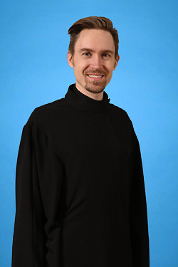

We are an [Orthodox Christian](https://en.wikipedia.org/wiki/Orthodox_christian) parish that belongs to [Diocese of the West](https://www.dowoca.org/) of the [Orthodox Church in America](http://www.oca.org/).

Our address is: [3214 N St, Vancouver, WA 98663](http://maps.google.com/maps?f=q&amp;source=s_q&amp;hl=en&amp;geocode=&amp;q=3214+N+St,+Vancouver,+WA+98663&amp;aq=0&amp;sll=37.0625,-95.677068&amp;sspn=61.540818,76.113281&amp;ie=UTF8&amp;hq=&amp;hnear=3214+N+St,+Vancouver,+Clark,+Washington+98663&amp;z=17)

## Schedule of services

Service time may vary. See the [calendar](/calendar/) for the most current information.

- Wednesday 
  - 6:00pm - Vespers
- Thursday
  - 6:00am or 9:30am - Divine Liturgy
- Saturday
  - 6:00pm - Great Vespers and confessions
- Sunday
  - 7:30am - Matins
  - 9:00am - Divine Liturgy, lunch and sunday school
- Eves of great feasts
  - 6:00pm - Vigil
- Mornings of great feasts
  - 9:30am - Divine Liturgy (times vary - see calendar)

## Parish Contacts

|       | **Rev. Michael Rozdilski**, *rector*  425-999-0407 Use the [contact form](/contact) to contact Fr. Michael online. | 
|       | **Dn. Alexander Ivkin**  650-701-3370 | 
|       | **Dn. Alexei Kojenov**  503-553-9860 | 

